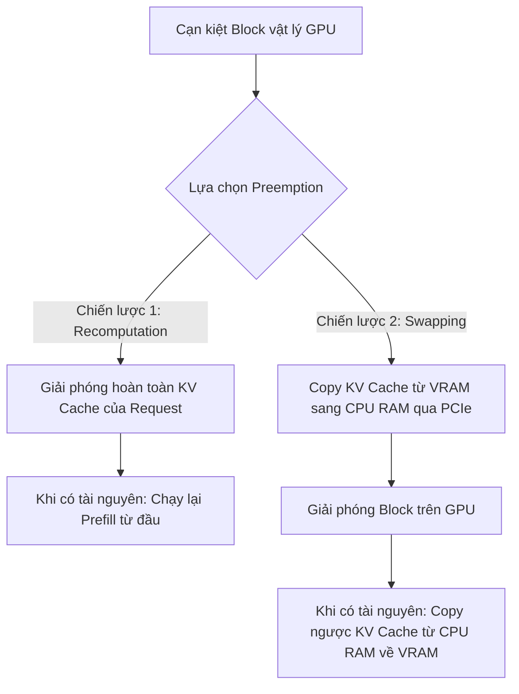

# Bài 3: Chiến lược Lập lịch tối ưu – Continuous Batching & Preemption

Trong các hệ thống Serving thông thường, để tăng băng thông (throughput), chúng ta phải gom nhiều request lại thành một lô (**batch**) trước khi đẩy vào GPU. Tuy nhiên, suy luận LLM có tính chất sinh token động: mỗi request có độ dài prompt khác nhau và kết thúc ở các bước khác nhau (do gặp token `<|endoftext|>` hoặc đạt giới hạn tối đa). 

Trong bài này, chúng ta sẽ nghiên cứu cách vLLM giải quyết triệt để bài toán ghép batch hiệu quả thông qua chiến lược **Continuous Batching** và cơ chế quản lý bộ nhớ khi quá tải: **Preemption**.

---

## 1. Bản chất của Lập lịch: Static vs Dynamic vs Continuous Batching

Để hiểu rõ tại sao **Continuous Batching** lại là một bước nhảy vọt về hiệu năng phục vụ LLM, hãy phân tích cơ chế hoạt động của 3 mô hình lập lịch phổ biến nhất:

### 1.1. Static Batching (Gom lô tĩnh)
* **Cơ chế**: Hệ thống chờ gom đủ một số lượng request cố định (ví dụ: $B = 2$), sau đó đóng gói chúng lại và thực hiện một chuỗi các bước forward liên tục cho đến khi **tất cả** các request trong batch hoàn thành.
* **Hạn chế vật lý**: 
  1. **Padding lãng phí**: Các request có prompt ngắn hơn phải được chèn thêm các token đệm (`[PAD]`) để có độ dài bằng prompt dài nhất trong lô.
  2. **Nghẽn bởi request chậm nhất**: Nếu `Req 1` sinh xong token kết thúc (`<|endoftext|>`) sớm hơn, nó vẫn không thể trả kết quả ngay cho người dùng mà phải tiếp tục chạy trong batch (dưới dạng token padding) để chờ `Req 2` hoàn thành.

#### Sơ đồ minh họa phân bổ bước chạy trong Static Batching:
```
┌─────────────────────────────────────────────────────────────────────────────┐
│ 1. STATIC BATCHING (Gom lô tĩnh)                                           │
├───────────┬──────────────┬──────────────┬──────────────┬────────────┬───────┤
│ Request   │ Iteration 1  │ Iteration 2  │ Iteration 3  │Iteration 4 │Padding│
├───────────┼──────────────┼──────────────┼──────────────┼────────────┼───────┤
│ Req 1     │ PROMPT       │ TOKEN 1      │ TOKEN 2(EOS) │ [PADDING]  │  25%  │
├───────────┼──────────────┼──────────────┼──────────────┼────────────┼───────┤
│ Req 2     │ PROMPT       │ TOKEN 1      │ TOKEN 2      │ TOKEN 3    │   0%  │
└───────────┴──────────────┴──────────────┴──────────────┴────────────┴───────┘
  * LƯU Ý: Req 1 hoàn thành ở Iteration 3, nhưng vẫn phải chiếm chỗ (Padding) ở
           Iteration 4 để chờ Req 2 hoàn thành. Không thể chèn Request mới vào.
```

---

### 1.2. Dynamic Batching (Gom lô động)
* **Cơ chế**: Cải tiến từ Static Batching bằng cách thiết lập một cửa sổ thời gian ngắn (ví dụ: 10ms). Tất cả các request đến trong khoảng thời gian này sẽ được ghép thành một lô động.
* **Hạn chế**: Dù gom lô thông minh hơn, nhưng một khi lô đã bắt đầu chạy, nó vẫn hoạt động theo cơ chế tĩnh: **GPU vẫn bị khóa chặt cho đến khi request dài nhất trong lô chạy xong**.

---

### 1.3. Continuous Batching (Lập lịch mức Iteration / Cell-level)
* **Cơ chế**: Được đề xuất trong bài báo *Orca (OSDI '22)*, cơ chế này thay đổi hoàn toàn đơn vị lập lịch. Hệ thống không lập lịch cho cả một "lô request" chạy từ đầu đến cuối, mà lập lịch **độc lập cho từng bước forward (từng Iteration)**.
* **Cách hoạt động**:
  1. Ở cuối mỗi Iteration (mỗi khi GPU sinh xong đúng 1 token cho các request đang chạy):
  2. Hệ thống kiểm tra trạng thái của các request. Nếu có bất kỳ request nào hoàn thành (sinh ra token EOS hoặc chạm giới hạn), hệ thống **lập tức loại nó ra khỏi batch và giải phóng bộ nhớ**.
  3. Ngay lập tức, hệ thống quét hàng đợi chờ (`Waiting Queue`). Nếu còn trống bộ nhớ và năng lực tính toán, nó sẽ **chèn ngay một request mới vào vị trí vừa trống** để bắt đầu chạy Prefill ở Iteration tiếp theo.

#### Sơ đồ minh họa phân bổ bước chạy trong Continuous Batching:
```
┌─────────────────────────────────────────────────────────────────────────────┐
│ 2. CONTINUOUS BATCHING (Lập lịch mức Iteration)                             │
├───────────┬──────────────┬──────────────┬──────────────┬────────────┬───────┤
│ Request   │ Iteration 1  │ Iteration 2  │ Iteration 3  │Iteration 4 │Padding│
├───────────┼──────────────┼──────────────┼──────────────┼────────────┼───────┤
│ Req 1     │ PROMPT       │ TOKEN 1      │ TOKEN 2(EOS) │ -- giải phóng --  │
├───────────┼──────────────┼──────────────┼──────────────┼────────────┼───────┤
│ Req 2     │ PROMPT       │ TOKEN 1      │ TOKEN 2      │ TOKEN 3    │   0%  │
├───────────┼──────────────┼──────────────┼──────────────┼────────────┼───────┤
│ Req 3     │ -- waiting --│ -- waiting --│ -- waiting --│ PROMPT     │ chèn! │
└───────────┴──────────────┴──────────────┴──────────────┴────────────┴───────┘
  * LƯU Ý: Ở Iteration 4, ngay khi Req 1 hoàn thành và được giải phóng, Req 3 
           lập tức được chèn vào vị trí trống của lô để xử lý prefill.
```

### 📊 Bảng so sánh tổng quan:

| Tiêu chí | Static Batching | Dynamic Batching | Continuous Batching |
| :--- | :--- | :--- | :--- |
| **Đơn vị lập lịch** | Cả Request | Cửa sổ thời gian (Request) | **Từng bước sinh Token (Iteration)** |
| **Padding Token** | Rất nhiều (Lãng phí năng lực tính toán) | Có (Giới hạn bởi request dài nhất) | **Không có (0% padding)** |
| **Độ trễ phản hồi** | Chậm (Đợi cả lô xong) | Chậm (Đợi cả lô xong) | **Nhanh (Streaming token ngay lập tức)** |
| **Hiệu suất GPU** | Thấp | Trung bình | **Tối đa (GPU liên tục bận rộn thực tế)** |

---

## 2. Các pha Lập lịch & Xung đột tài nguyên (Prefill vs Decode)

Trong một batch chạy Continuous Batching, chúng ta sẽ có hai loại request chạy song song:
1. **Decode Requests**: Các request đã qua pha xử lý prompt, đang sinh từng token một. Chúng tốn ít tính toán (Compute-bound nhẹ) nhưng chiếm giữ KV Cache ổn định và tăng dần theo thời gian.
2. **Prefill Requests**: Các request mới tinh vừa được đẩy từ hàng đợi vào batch để xử lý prompt ban đầu. Chúng cần năng lực tính toán cực lớn (Compute-bound nặng) nhưng KV Cache ban đầu được khởi tạo hàng loạt.

### Xung đột tài nguyên:
* Nếu chúng ta ưu tiên chạy quá nhiều **Prefill**: GPU sẽ chạy cực nhanh ở pha tính toán lớn, nhưng lượng KV Cache tăng vọt đột ngột có thể khiến toàn bộ các request đang Decode bị thiếu bộ nhớ GPU và gây ra lỗi Out-Of-Memory (OOM).
* Nếu chúng ta chỉ chạy **Decode**: Băng thông tính toán của GPU bị lãng phí vì pha Decode có Arithmetic Intensity quá thấp.

### Thuật toán lập lịch của vLLM:
vLLM giải quyết bài toán này bằng cách giới hạn số lượng token tối đa được lập lịch trong một bước (`max_num_scheduled_tokens`, mặc định thường là 2048 hoặc 4096).
* Ưu tiên số 1: Tiếp tục lập lịch cho các request đang chạy (`Running Queue`) để chúng hoàn thành sớm nhất có thể.
* Ưu tiên số 2: Nếu còn dư "ngân sách" token (token budget) và còn khối vật lý trống, nạp thêm các request từ hàng đợi chờ (`Waiting Queue`) để chạy Prefill.

---

## 3. Cơ chế Preemption: Recomputation vs Swapping

Khi chạy Continuous Batching với Batch size lớn, sẽ có thời điểm tổng nhu cầu lưu trữ KV Cache của các request đang chạy vượt quá số lượng khối vật lý khả dụng trên GPU (VRAM bị cạn kiệt do các request sinh ra chuỗi quá dài). 

Thay vì để hệ thống bị sập vì lỗi Out-Of-Memory (OOM), vLLM chủ động thực hiện cơ chế **Preemption (Tranh đoạt/Thu hồi bộ nhớ)**: tạm dừng một hoặc nhiều request có độ ưu tiên thấp nhất (hoặc đến sau cùng) để nhường bộ nhớ cho các request còn lại hoàn thành.

vLLM hỗ trợ hai chiến lược thu hồi bộ nhớ:



### Chiến lược 1: Recomputation (Tính toán lại)
* **Cách hoạt động**: Giải phóng toàn bộ các khối vật lý đang chứa KV Cache của request bị tạm dừng. Request này bị đẩy ngược về đầu hàng đợi `Waiting Queue` dưới dạng một request mới. Khi hệ thống có đủ chỗ trống, nó sẽ chạy lại pha Prefill từ đầu cho toàn bộ prompt + các token đã sinh ra của request đó.
* **Ưu điểm**: Không tốn dung lượng bộ nhớ CPU RAM để lưu trữ tạm, không tốn thời gian truyền dữ liệu qua PCIe.
* **Nhược điểm**: Lãng phí năng lực tính toán của GPU vì phải tính toán lại từ đầu.
* **Khi nào sử dụng**: Thích hợp khi request bị tạm dừng có độ dài chuỗi ngắn (chi phí tính toán lại thấp) hoặc hệ thống không có kết nối băng thông cao với RAM hệ thống.

### Chiến lược 2: Swapping (Tráo đổi bộ nhớ)
* **Cách hoạt động**: Thay vì xóa bỏ, vLLM sao chép các khối KV Cache vật lý của request bị tạm dừng từ VRAM GPU sang bộ nhớ RAM hệ thống (CPU RAM) thông qua giao tiếp PCIe. Sau đó giải phóng các khối đó trên GPU để cấp cho request khác. Khi request được phục hồi, hệ thống lại copy ngược KV Cache từ CPU RAM về GPU VRAM.
* **Ưu điểm**: Giữ nguyên tiến độ sinh token, không phải tính toán lại bất kỳ phép tính nào.
* **Nhược điểm**: Bị giới hạn bởi băng thông của khe cắm PCIe (ví dụ PCIe Gen 4 x16 chỉ đạt tối đa $\approx 32\text{ GB/s}$). Quá trình truyền dữ liệu này có thể gây ra hiện tượng nghẽn mạng cục bộ nếu kích thước KV Cache quá lớn.
* **Khi nào sử dụng**: Thích hợp khi request bị tạm dừng đã sinh ra chuỗi rất dài (nếu chạy lại sẽ cực kỳ tốn compute), và máy chủ serving có RAM CPU lớn cùng băng thông PCIe cao.

---

## 4. Chunked Prefill & Multi-step Execution

Mặc dù Continuous Batching giúp tăng băng thông rất nhiều, hệ thống phục vụ vẫn có thể gặp vấn đề về **độ trễ (latency)**. 

### Vấn đề "Latency Spikes" (Giật cục độ trễ):
Khi một request mới với Prompt cực dài (ví dụ 8000 tokens) đi vào hệ thống:
* Ở bước đầu tiên (Prefill), GPU phải dành toàn bộ tài nguyên để xử lý 8000 tokens này cùng một lúc.
* Bước forward này có thể tốn tới vài trăm mili-giây.
* Trong thời gian đó, tất cả các request khác trong batch đang chạy Decode (vốn chỉ mất khoảng 10-20ms cho mỗi token) bị chặn lại và phải đợi bước Prefill này hoàn thành. Người dùng đang nhận stream output sẽ cảm nhận thấy một khoảng dừng đột ngột (Time-to-First-Token của request mới tốt nhưng Time-Per-Output-Token của các request cũ bị tăng vọt).

### Giải pháp: Chunked Prefill
vLLM giải quyết vấn đề này bằng cách chia nhỏ Prompt của pha Prefill thành các khối nhỏ hơn (các chunk, ví dụ mỗi chunk 512 tokens).
* Thay vì chạy prefill 8000 tokens cùng lúc, vLLM chạy prefill từng chunk 512 tokens ở mỗi iteration.
* Giữa các chunk prefill đó, vLLM vẫn tiếp tục chạy chèn các bước Decode của các request khác.
* Bằng cách này, thời gian xử lý của mỗi bước forward được giữ ở mức thấp và ổn định (ví dụ dưới 50ms), loại bỏ hoàn toàn hiện tượng giật cục độ trễ, đem lại trải nghiệm mượt mà cho người dùng cuối.

---

## 💡 Tổng kết bài học
* **Continuous Batching** lập lịch ở mức **Iteration** thay vì mức Request, loại bỏ hoàn toàn lãng phí của padding và tối ưu hóa hiệu suất GPU.
* **Preemption** là chốt chặn an toàn giúp hệ thống không bị crash OOM khi cạn bộ nhớ GPU. Hai chiến lược **Recomputation** và **Swapping** được lựa chọn dựa trên sự đánh đổi giữa năng lực tính toán (Compute) và băng thông truyền dữ liệu (Bandwidth).
* **Chunked Prefill** giúp ổn định độ trễ của hệ thống bằng cách chia nhỏ các tác vụ prefill dài để chạy đan xen với các decode ngắn.

Trong bài học tiếp theo, chúng ta sẽ bắt đầu nghiên cứu kiến trúc thiết kế chi tiết của vLLM làm thế nào để vận hành các thuật toán này một cách bất đồng bộ: **Async Serving, Concurrency & Streaming**.
