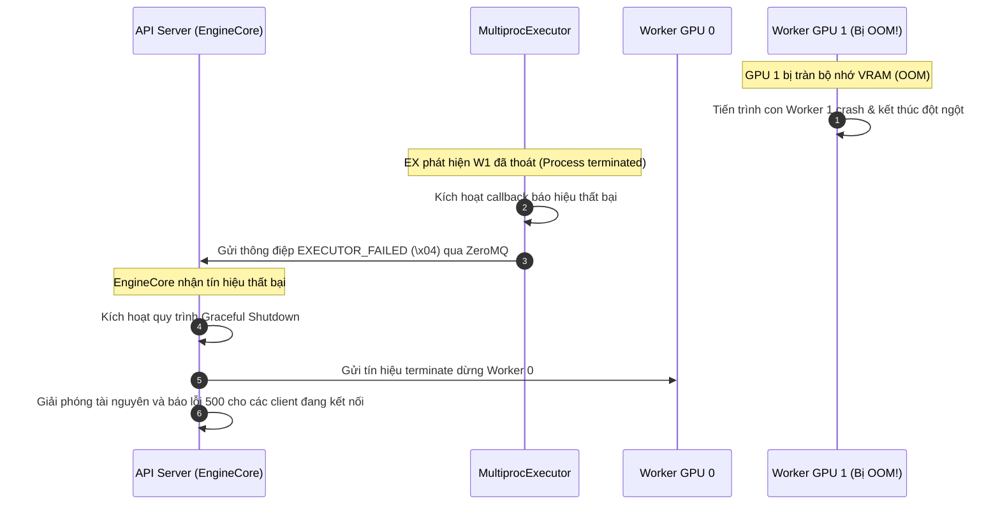

# Bài 6.4: Ray vs Multiprocessing - Cơ chế điều phối Worker và xử lý lỗi

Khi phục vụ các mô hình ngôn ngữ lớn (LLM) trên môi trường đa GPU, nhiệm vụ quản lý vòng đời của các tiến trình Worker chạy song song trên các GPU là một trong những bài toán phức tạp nhất. vLLM phải đảm bảo các worker này được khởi chạy đồng bộ, truyền dữ liệu với độ trễ thấp và lập tức phát hiện nếu có một worker bị lỗi để tránh treo toàn bộ hệ thống.

Bài học này sẽ mổ xẻ nguyên nhân tại sao Ray từng là sự lựa chọn duy nhất nhưng lại trở thành nút thắt cổ chai trên cấu hình đơn server (Single-Node), cách vLLM v1 chuyển dịch sang kiến trúc **Multiprocessing** bản địa, và luồng mã nguồn xử lý lỗi khi xảy ra sự cố OOM trên GPU.

---

## 1. Tại sao Ray là nút thắt cổ chai khi phục vụ đơn Server (Single-Node)?

Trong các phiên bản vLLM v0, Ray (một framework tính toán phân tán phổ biến) được sử dụng làm lõi quản lý tiến trình mặc định cho tất cả các cấu hình đa GPU. Ray rất mạnh mẽ khi điều phối hàng chục GPU trên nhiều server vật lý khác nhau (Multi-Node). Tuy nhiên, đối với kịch bản phổ biến nhất là chạy trên **đúng 1 server vật lý** (ví dụ server chứa 8x GPU H100 hoặc A100), Ray bộc lộ nhiều nhược điểm nghiêm trọng:

### A. Độ trễ khởi động quá lớn (Startup Latency)
Mỗi lần khởi chạy API Server, vLLM phải khởi động một Ray cluster ảo cục bộ, khởi tạo Ray driver và spawn các Ray Actors tương ứng với từng GPU. Quá trình này tốn từ 20 đến 45 giây chỉ để thiết lập môi trường trước khi bắt đầu nạp model weights. Điều này gây khó khăn lớn cho việc scale-out động trong môi trường Kubernetes (nơi các replica cần khởi động nhanh để đáp ứng peak traffic).

### B. Ray Actor Overhead
Ray Actors giao tiếp với nhau và với Driver thông qua các cuộc gọi gRPC nội bộ hoặc thông qua bộ nhớ chia sẻ Plasma Store của Ray. Các tin nhắn đồng bộ hóa metadata KV Cache hoặc trạng thái lập lịch ở mỗi bước sinh token (Iteration) phải đi qua lớp ảo hóa của Ray, tạo ra overhead serialization/deserialization và độ trễ CPU bổ sung đáng kể cho mỗi bước decode.

### C. Độ ổn định kém trên môi trường Cloud
Trong thực tế production, Ray thường xuyên gặp các lỗi ngắt kết nối bí ẩn (ví dụ: `RayActorError: The actor died unexpectedly before finishing this task`). Các lỗi này rất khó debug vì Ray che giấu stack trace lỗi CUDA bên dưới, khiến hệ thống báo lỗi không rõ nguyên nhân và treo cứng API Server.

---

## 2. Thiết kế MultiprocExecutor của vLLM v1

Nhận thấy các hạn chế trên, vLLM v1 đã xây dựng lớp [MultiprocExecutor](file:///Users/admin/TuanDung/repos/vllm/vllm/v1/executor/multiproc_executor.py) (kế thừa từ lớp cha [Executor](file:///Users/admin/TuanDung/repos/vllm/vllm/v1/executor/abstract.py)) để làm trình điều phối worker mặc định cho cấu hình đơn node.

```
[ vLLM v1 API Server / EngineCore ]
               │
   ┌───────────┴───────────┐
   ▼ (ZeroMQ IPC / Shared Memory)
[ MultiprocExecutor ]
   ├── [ Worker Process GPU 0 ]
   ├── [ Worker Process GPU 1 ]
   ├── [ Worker Process GPU 2 ]
   └── [ Worker Process GPU 3 ]
```

### Nguyên lý hoạt động của `MultiprocExecutor`
Thay vì dựa vào Ray, `MultiprocExecutor` sử dụng trực tiếp module `multiprocessing` tiêu chuẩn của Python kết hợp với thư viện truyền thông **ZeroMQ (ZMQ)** để quản lý worker cục bộ:

1.  **Khởi tạo nhanh gọn**: `MultiprocExecutor` sử dụng phương thức `spawn` của Python `multiprocessing` để tạo trực tiếp các tiến trình con Worker chạy trên từng GPU độc lập. Thời gian khởi tạo giảm xuống còn **dưới 2 giây**.
2.  **Truyền tin Zero-copy qua Shared Memory**: Để truyền tải các metadata dung lượng lớn (như bảng ánh xạ KV Cache Blocks của hàng trăm request hay kết quả Logits khổng lồ) giữa API Server và các Worker, vLLM v1 sử dụng trực tiếp **Shared Memory** của hệ điều hành. API Server chỉ việc ghi dữ liệu vào vùng nhớ dùng chung, và các Worker đọc trực tiếp qua con trỏ (Pointers), hoàn toàn không tốn chi phí copy dữ liệu qua giao thức mạng hay IPC truyền thống.
3.  **ZeroMQ Router-Dealer**: Việc đồng bộ hóa lệnh thực thi ở mỗi bước lặp được thực hiện qua cổng ZeroMQ IPC cực kỳ gọn nhẹ và có độ trễ cực thấp (micro-seconds).

---

## 3. Cơ chế giám sát và xử lý lỗi Worker (Fault Tolerance)

Một trong những bài toán nhức nhối nhất khi chạy phục vụ đa GPU là: **Nếu một GPU bị lỗi (ví dụ GPU 2 bị OOM hoặc Segfault), hệ thống sẽ xử lý thế nào?**

Nếu không có cơ chế phát hiện và xử lý chủ động, API Server sẽ bị treo vô thời hạn vì nó mãi mãi đợi phản hồi từ tiến trình Worker đã chết của GPU 2 (hiện tượng Deadlock).

### Luồng xử lý lỗi trong vLLM v1

vLLM v1 giải quyết bài toán này thông qua cơ chế giám sát tiến trình con chặt chẽ:



### Phân tích chi tiết luồng mã nguồn

#### Bước 1: Đăng ký callback báo lỗi
Khi khởi tạo `EngineCore`, hệ thống đăng ký một callback báo lỗi với `MultiprocExecutor` thông qua phương thức `register_failure_callback()`:

```python
# Trích từ v1/engine/core.py:
self.model_executor = executor_class(vllm_config)
if executor_fail_callback is not None:
    self.model_executor.register_failure_callback(executor_fail_callback)
```

#### Bước 2: Phát hiện tiến trình con chết
Trong [multiproc_executor.py](file:///Users/admin/TuanDung/repos/vllm/vllm/v1/executor/multiproc_executor.py), tiến trình cha liên tục giám sát trạng thái của các tiến trình con bằng cách kiểm tra thuộc tính `exitcode` của chúng hoặc bắt các tín hiệu kết thúc từ hệ điều hành. 

#### Bước 3: Phát tín hiệu hạ cánh khẩn cấp (`EXECUTOR_FAILED`)
Khi một tiến trình con bị crash, `MultiprocExecutor` sẽ phát đi mã byte đặc biệt `EXECUTOR_FAILED` (định nghĩa là `b"\x04"` trong [__init__.py](file:///Users/admin/TuanDung/repos/vllm/vllm/v1/engine/__init__.py)) qua kênh ZeroMQ IPC.

API Server nhận được mã byte này sẽ lập tức hiểu rằng một GPU worker đã chết. Thay vì tiếp tục chờ đợi dữ liệu trong vô vọng, nó sẽ thực hiện:
1.  **Dừng khẩn cấp các worker khác**: Gửi tín hiệu SIGTERM tới tất cả các tiến trình worker con còn sống để giải phóng toàn bộ VRAM trên các GPU khác, tránh hiện tượng rò rỉ tiến trình chạy ngầm (zombie processes).
2.  **Hủy các request đang chờ**: Trả về lỗi HTTP 500 (Internal Server Error) ngay lập tức cho toàn bộ các client đang kết nối trực tiếp đến server để client có thể failover sang replica khác, thay vì để client chờ đợi cho tới khi bị timeout kết nối.

---

## 4. Liên hệ với Toy Engine: Sự đơn giản hóa trong Mô phỏng

Để hiểu sâu sắc lý do vLLM cần cấu trúc điều phối phức tạp này, hãy đối chiếu với mô hình mô phỏng [Toy Serving Engine](file:///Users/admin/TuanDung/vllm-architecture-lectures/toy_engine/) của chúng ta:

*   **Toy Engine (Đơn tiến trình Async)**: Trong [app.py](file:///Users/admin/TuanDung/vllm-architecture-lectures/toy_engine/app.py) và [scheduler.py](file:///Users/admin/TuanDung/vllm-architecture-lectures/toy_engine/scheduler.py), API Server và Scheduler chia sẻ chung không gian bộ nhớ RAM và chạy trên một luồng duy nhất thông qua vòng lặp sự kiện `asyncio`. Việc giao tiếp dữ liệu giữa API và Scheduler cực kỳ đơn giản: chúng ta truyền trực tiếp tham chiếu của đối tượng Python (`Request`) qua `asyncio.Queue` mà không cần serialization, IPC, hay đồng bộ hóa bộ nhớ. Lỗi xảy ra ở bất kỳ đâu cũng sẽ được bắt bằng block `try/except` tiêu chuẩn.
*   **Production vLLM (Đa tiến trình song song)**: Để khai thác sức mạnh của nhiều GPU vật lý, vLLM buộc phải từ bỏ mô hình đơn luồng do giới hạn của Python GIL (Global Interpreter Lock). Việc chạy mỗi GPU trên một tiến trình Worker độc lập tạo ra rào cản bộ nhớ cô lập. `MultiprocExecutor` sinh ra để bắc cầu nối qua rào cản này bằng ZeroMQ IPC và Shared Memory, đồng thời phải tự giám sát trạng thái hệ điều hành để phát hiện crash tiến trình vì các lỗi GPU OOM hay Segfault không thể được bắt bằng `try/except` từ tiến trình cha.

---

## 💡 Tổng kết bài học

*   **Ray cluster** phù hợp cho phục vụ phân tán đa node (Multi-Node), nhưng gây ra overhead lớn về startup latency và độ trễ CPU khi chạy trên đơn server (Single-Node).
*   **vLLM v1 MultiprocExecutor** tối ưu hóa phục vụ đơn node bằng cách sử dụng Python `multiprocessing` thuần, kết hợp truyền dữ liệu zero-copy qua **Shared Memory** và đồng bộ lệnh bằng **ZeroMQ IPC**.
*   **Fault Tolerance**: Cơ chế giám sát chủ động giúp phát hiện ngay lập tức worker bị crash (do OOM hoặc lỗi CUDA) và phát đi tín hiệu `EXECUTOR_FAILED` (`\x04`) để shutdown hệ thống an toàn, tránh treo API Server vô thời hạn.
