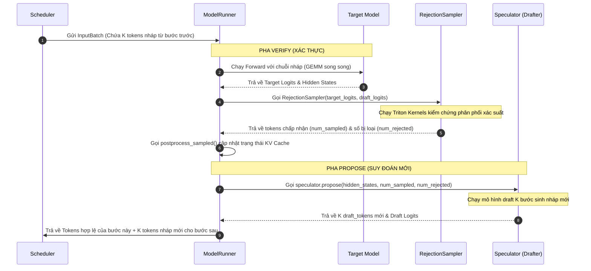

# Bài 7.2.1: Đi sâu mã nguồn - Cách vLLM hiện thực hóa Speculative Decoding

Ở bài học trước, chúng ta đã tìm hiểu bản chất toán học của Rejection Sampling và cách Block Manager thực hiện thu hồi (rollback) KV Cache. Bài học này sẽ dẫn dắt bạn đi sâu vào mã nguồn thực tế của vLLM để mổ xẻ cách hệ thống tích hợp luồng suy đoán vào vòng lặp thực thi trên GPU và cách các Triton kernels tối ưu hóa quá trình này.

---

## 1. Sự chuyển dịch kiến trúc: Từ v0 sang v1

Một trong những lý do lớn nhất khiến Speculative Decoding ở các phiên bản vLLM v0 gặp khó khăn khi triển khai trên production là **overhead giao tiếp**.

### Kiến trúc v0: Đa tiến trình (Multi-worker)
Trong vLLM v0, speculative decoding được thiết kế thông qua lớp `SpecDecodeWorker`. Lớp này đóng vai trò điều phối giữa hai worker độc lập:
*   **Target Worker**: Chạy mô hình lớn (Target Model).
*   **Draft Worker**: Chạy mô hình nhỏ (Draft Model).

```
[ vLLM v0 SpecDecodeWorker ]
   ├── (IPC / Ray) ──> [ Draft Worker (GPU 0) ]  ──> Sinh nháp K tokens
   └── (IPC / Ray) ──> [ Target Worker (GPU 1) ] ──> Xác thực song song
```

Do hai mô hình chạy trên các tiến trình (thậm chí là GPU) khác nhau, mỗi bước suy đoán đều phải đồng bộ hóa dữ liệu (như input IDs, logits, metadata) qua các kênh IPC (Inter-Process Communication) hoặc Ray RPC. Với các mô hình draft cực nhỏ (ví dụ 1B), thời gian giao tiếp IPC và serialization đôi khi lớn hơn cả thời gian chạy forward thực tế của mô hình nháp, làm triệt tiêu lợi ích tăng tốc.

### Kiến trúc v1: Tích hợp đơn tiến trình (Single-worker Loop)
Để giải quyết triệt để nút thắt này, vLLM v1 đã tái cấu trúc hoàn toàn hệ thống. Trong v1, đối tượng **Speculator** (ví dụ `EagleSpeculator` hay `MlpSpeculator`) được khởi tạo và chạy trực tiếp ngay bên trong tiến trình [ModelRunner](file:///Users/admin/TuanDung/repos/vllm/vllm/v1/worker/gpu/model_runner.py) của Target Model.

```
[ vLLM v1 ModelRunner (GPU 0) ]
   ├── Target Model (Forward pass & Verification)
   └── Speculator (Chạy trực tiếp trong ModelRunner, 0% IPC overhead)
```

Việc tích hợp này giúp:
1.  **Không tốn chi phí IPC/RPC**: Các tensor như `hidden_states`, `input_ids`, `logits` được truyền trực tiếp bằng tham chiếu bộ nhớ GPU (Pointers) hoặc copy nội bộ trong cùng một GPU VRAM.
2.  **Đồng bộ luồng CUDA tối ưu**: Sử dụng trực tiếp `main_stream` và `output_copy_stream` để đan xen tính toán và sao chép dữ liệu.

---

## 2. Luồng Propose-Verify trong ModelRunner

Hãy cùng theo dõi vòng lặp thực thi của [ModelRunner](file:///Users/admin/TuanDung/repos/vllm/vllm/v1/worker/gpu/model_runner.py) ở mỗi bước decode để thấy cách pha **Verify** (Xác thực) và pha **Propose** (Suy đoán) đan xen với nhau.

### Sơ đồ tuần tự (Sequence Diagram)



### Chi tiết luồng code trong `model_runner.py`

Khi một lượt suy luận bắt đầu, Scheduler gửi lên một `InputBatch` chứa thông tin các token nháp được đề xuất ở bước trước.

#### Bước 1: Xác thực (Verify)
Trong phương thức `sample_tokens()`, nếu batch có chứa token nháp (`num_draft_tokens > 0`), hệ thống sẽ bỏ qua bộ lấy mẫu thông thường và gọi [RejectionSampler](file:///Users/admin/TuanDung/repos/vllm/vllm/v1/worker/gpu/spec_decode/rejection_sampler.py):

```python
# Trích từ model_runner.py: sample()
if input_batch.num_draft_tokens == 0:
    # Trường hợp chạy decode bình thường
    sampler_output = self.sampler(logits, input_batch)
else:
    # Gọi bộ lấy mẫu bác bỏ cho speculative decoding
    assert self.rejection_sampler is not None
    assert self.speculator is not None
    sampler_output = self.rejection_sampler(
        logits,
        input_batch,
        self.speculator.draft_logits,  # Truyền logits nháp của bước trước để đối chứng
    )
```

Sau khi chạy xác thực, hệ thống xác định được chính xác số lượng token được chấp nhận (`num_sampled`) và số lượng bị bác bỏ (`num_rejected`) để tiến hành cập nhật bảng trang KV Cache thông qua `postprocess_sampled()`.

#### Bước 2: Suy đoán (Propose)
Ngay sau pha xác thực, `ModelRunner` tận dụng các hidden states vừa tính toán của Target Model để làm context đầu vào cho speculator sinh nháp chuỗi tiếp theo:

```python
# Trích từ model_runner.py: sample_tokens()
if self.speculator is not None:
    # Gọi speculator sinh tiếp K tokens nháp cho chu kỳ tiếp theo
    draft_tokens = self.speculator.propose(
        input_batch,
        attn_metadata,
        slot_mappings_by_layer,
        spec_hidden_states,
        aux_hidden_states,
        num_sampled,
        num_rejected,
        self.req_states.last_sampled_tokens,
        self.req_states.next_prefill_tokens,
        self.sampler.sampling_states.temperature.gpu,
        self.sampler.sampling_states.seeds.gpu,
        mm_inputs=mm_inputs,
    )
```

Chuỗi `draft_tokens` mới này sẽ được ghi vào trạng thái request và gửi ngược lại Scheduler để đưa vào lượt lập lịch kế tiếp.

---

## 3. Hiện thực hóa Rejection Sampling qua Triton Kernels

Lớp [RejectionSampler](file:///Users/admin/TuanDung/repos/vllm/vllm/v1/worker/gpu/spec_decode/rejection_sampler.py) trong vLLM v1 gọi trực tiếp hàm `rejection_sample()` được viết bằng Triton trong tệp [rejection_sampler_utils.py](file:///Users/admin/TuanDung/repos/vllm/vllm/v1/worker/gpu/spec_decode/rejection_sampler_utils.py). Điều này giúp tối ưu hóa hiệu năng song song hóa trên GPU khi duyệt qua hàng chục request trong batch đồng thời.

Hãy cùng phân tích các Triton kernels chính thực thi thuật toán này.

### 3.1. Kernel 1: Kiểm thử chấp nhận (`_rejection_kernel`)
Kernel này duyệt qua chuỗi token nháp $x_1, x_2, \dots, x_K$ của từng request và kiểm tra điều kiện chấp nhận:

$$\alpha = \min\left(1, \frac{p(x_i)}{q(x_i)}\right)$$

Trong không gian log-probability (để đảm bảo độ ổn định số học và tránh hiện tượng underflow), điều kiện $r \le \alpha$ (với $r \sim U(0, 1)$) tương đương với:

$$\log(p(x_i)) > \log(r) + \log(q(x_i))$$

Hãy xem cách Triton hiện thực hóa phép so sánh này:

```python
# Trích từ rejection_sampler_utils.py: _rejection_kernel
# target_log_prob: xác suất của token nháp xi sinh bởi Target Model: log(p(xi))
# draft_log_prob: xác suất của token nháp xi sinh bởi Draft Model: log(q(xi))
# u: số ngẫu nhiên lấy mẫu từ phân phối đều U(0, 1)

if SYNTHETIC_MODE:
    rate = tl.load(synthetic_conditional_rates_ptr + i)
    accepted &= u < rate
else:
    # Phép so sánh tỷ lệ xác suất trong log space
    accepted &= target_log_prob > tl.log(u) + draft_log_prob

# Ghi nhận kết quả
tl.store(sampled_ptr + req_idx * sampled_stride + i, draft_sampled)
rejected_step += accepted
```

Nếu tại một bước $i$ bất kỳ, `accepted` trở thành `False`, vòng lặp sẽ đánh dấu vị trí bị bác bỏ và dừng lại.

### 3.2. Kernel 2: Lấy mẫu lại khi bị bác bỏ (`_resample_kernel`)
Tại vị trí đầu tiên bị bác bỏ, hệ thống phải sinh ra một token mới thay thế từ phân phối hiệu chỉnh:

$$p'(x) = \frac{\max(0, p(x) - q(x))}{\sum_{y} \max(0, p(y) - q(y))}$$

Trong Triton kernel, phân phối hiệu chỉnh này được tính toán cực kỳ tinh tế trong log space để tránh tràn số:

```python
# Trích từ rejection_sampler_utils.py: _resample_kernel
# target_log_probs: log(p(x))
# draft_log_probs: log(q(x))

# Tính toán giá trị hiệu chỉnh: log(max(exp(log_p) - exp(log_q), 0))
# Công thức ổn định số học: a + log(max(1 - exp(b - a), 0)) với a = log_p, b = log_q
ratio = tl.exp(draft_log_probs - target_log_probs)

residual_logits = tl.where(
    ratio < 1.0,
    target_log_probs + tl.log(1.0 - ratio),
    float("-inf"),  # Nếu p(x) <= q(x), xác suất hiệu chỉnh bằng 0 (log = -inf)
)
```

Sau đó, hệ thống sử dụng giải thuật **Gumbel Argmax** (`gumbel_block_argmax`) để lấy mẫu token ngẫu nhiên trực tiếp từ phân phối `residual_logits` này mà không cần thực hiện thao tác phân phối xác suất tích lũy (CDF) đắt đỏ trên GPU.

---

## 4. Cơ chế hoạt động của EagleSpeculator

EAGLE là một trong những phương pháp speculative decoding phổ biến và hiệu quả nhất trong vLLM. Khác với các mô hình nháp thông thường chỉ nhận token IDs làm đầu vào, EAGLE nhận cả **hidden states** của Target Model từ bước trước đó.

Lớp [EagleSpeculator](file:///Users/admin/TuanDung/repos/vllm/vllm/v1/worker/gpu/spec_decode/eagle/speculator.py) thực thi quy trình suy đoán qua các bước chính sau:

### 4.1. Chuẩn bị đầu vào (`propose`)
Khi nhận hidden states từ Target Model, `EagleSpeculator` sao chép dữ liệu và căn chỉnh lại kích thước batch để khớp với CUDA Graphs:

```python
# Trích từ speculator.py: propose()
# Copy hidden states của Target Model sang buffer của speculator
self.hidden_states[:num_tokens].copy_(hidden_states)

# Chuẩn bị input IDs, vị trí và độ dài chuỗi
prepare_eagle_inputs(
    self.last_token_indices,
    self.current_draft_step,
    self.input_buffers,
    input_batch,
    num_sampled,
    num_rejected,
    last_sampled,
    next_prefill_tokens,
    self.max_num_reqs,
)
```

### 4.2. Khởi động nháp (Prefill Draft)
Bước đầu tiên của quá trình đề xuất (draft step 0) được thực hiện bằng cách chạy mô hình nháp với context là hidden states của target model. Bước này thường được tối ưu bằng CUDA Graph:

```python
if prefill_batch_desc.cg_mode == CUDAGraphMode.FULL:
    # Replay CUDA Graph prefill của mô hình nháp để tránh CPU overhead
    self.prefill_cudagraph_manager.run_fullgraph(prefill_batch_desc)
else:
    # Chạy prefill dạng eager thông thường
    self.prefill(...)
```

### 4.3. Sinh nháp đa bước (Multi-step Decode)
Các bước nháp tiếp theo từ vị trí $1$ đến $K-1$ được thực hiện tuần tự qua vòng lặp `multi_step_decode()`. Ở mỗi bước, token vừa được mô hình nháp sinh ra sẽ được nạp lại làm đầu vào cho bước tiếp theo:

```python
# Trích từ speculator.py: multi_step_decode()
for step in range(1, self.num_speculative_steps):
    self.current_draft_step.fill_(step)
    
    if batch_desc.cg_mode == CUDAGraphMode.FULL:
        # Replay CUDA Graph decode của mô hình nháp
        self.decode_cudagraph_manager.run_fullgraph(batch_desc)
    else:
        # Chạy sinh nháp eager
        self.generate_draft(...)
```

Kết quả cuối cùng là một ma trận `self.draft_tokens` kích thước `[batch_size, K]` chứa toàn bộ các token nháp sẵn sàng cho bước xác thực ở chu kỳ tiếp theo của Target Model.

---

## 💡 Tổng kết bài học

*   **vLLM v1** loại bỏ hoàn toàn chi phí giao tiếp IPC bằng cách đưa speculator chạy trực tiếp trong `ModelRunner` của Target Model.
*   Pha **Verify** được thực hiện thông qua Triton-optimized [RejectionSampler](file:///Users/admin/TuanDung/repos/vllm/vllm/v1/worker/gpu/spec_decode/rejection_sampler.py) chạy song song trên GPU.
*   Triton kernels trong [rejection_sampler_utils.py](file:///Users/admin/TuanDung/repos/vllm/vllm/v1/worker/gpu/spec_decode/rejection_sampler_utils.py) thực thi quy trình toán học Rejection Sampling và Resampling bằng log space và Gumbel Argmax cực kỳ ổn định và hiệu năng cao.
*   **EAGLE** tận dụng hidden states từ mô hình target và được tăng tốc toàn diện thông qua việc chụp trước các nhánh thực thi bằng **CUDA Graphs** (`prefill_cudagraph_manager` và `decode_cudagraph_manager`).
