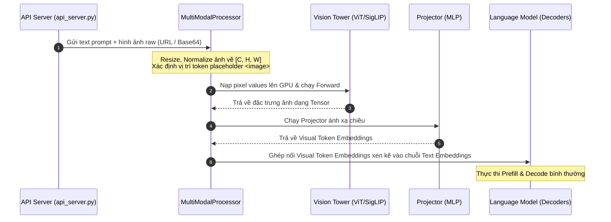

# Bài 7.5: Kiến trúc nạp dữ liệu Multimodal trong vLLM

Sự phát triển vượt bậc của các mô hình ngôn ngữ đa phương thức (Large Multimodal Models - LMMs hay VLMs) như Qwen-VL, LLaVA, hay InternVL mang lại khả năng phân tích hình ảnh, video và âm thanh vượt trội. Để phục vụ các mô hình này hiệu năng cao, vLLM phải tích hợp một hệ thống nạp dữ liệu (data ingestion pipeline) phức tạp để chuyển đổi các tệp đa phương tiện thành các token vector nhúng tích hợp thẳng vào mô hình ngôn ngữ.

Bài học này sẽ mổ xẻ cấu trúc hệ thống nạp dữ liệu đa phương thức bên trong vLLM thông qua kiến trúc bộ đăng ký Multimodal Registry và quy trình biến đổi từ pixel thô sang visual tokens.

---

## 1. Kiến trúc tổng quan của một mô hình Vision-Language Model (VLM)

Một mô hình VLM điển hình phục vụ trong vLLM thường được chia thành 3 cấu phần chính:

```
                  ┌──────────────────────┐
                  │ Image / Video / Audio│
                  └──────────┬───────────┘
                             ▼
┌──────────────┐  ┌──────────────────────┐
│ Text Prompt  │  │     Vision Tower     │ (Trích xuất đặc trưng pixel)
└──────┬───────┘  └──────────┬───────────┘
       │                     ▼
       │          ┌──────────────────────┐
       │          │      Projector       │ (Ánh xạ chiều vector)
       │          └──────────┬───────────┘
       ▼                     ▼
┌────────────────────────────────────────┐
│           Language Model (LLM)         │ (Sinh văn bản tự hồi quy)
└────────────────────────────────────────┘
```

1.  **Vision Tower (Bộ mã hóa thị giác)**: Thường sử dụng các kiến trúc Transformer thị giác (Vision Transformer - ViT hoặc SigLIP). Cấu phần này nhận đầu vào là các pixel ảnh thô đã được tiền xử lý (resize, normalize) và trích xuất ra các vector đặc trưng không gian.
2.  **Projector (Bộ chiếu đặc trưng)**: Thường là một tầng tuyến tính đơn giản (Linear Layer) hoặc MLP 2 tầng. Nhiệm vụ của nó là ánh xạ (project) các vector đặc trưng thị giác từ không gian biểu diễn của Vision Tower sang không gian embedding của mô hình ngôn ngữ (LLM).
3.  **Language Model (LLM)**: Nhận chuỗi các token nhúng của văn bản xen kẽ với các visual tokens nhúng từ Projector để thực hiện sinh tự hồi quy (autoregressive decoding) ra các token tiếp theo.

---

## 2. Bộ đăng ký Multimodal Registry trong vLLM

Để hỗ trợ đa dạng nhiều loại mô hình đa phương thức khác nhau một cách linh hoạt, vLLM v1 tổ chức module quản lý tập trung trong thư mục [multimodal](file:///Users/admin/TuanDung/repos/vllm/vllm/multimodal/).

Trọng tâm của thiết kế này là lớp `MultiModalRegistry` nằm trong [registry.py](file:///Users/admin/TuanDung/repos/vllm/vllm/multimodal/registry.py):

*   **Đăng ký định dạng dữ liệu (Modalities)**: vLLM hỗ trợ các modality chính thông qua [inputs.py](file:///Users/admin/TuanDung/repos/vllm/vllm/multimodal/inputs.py), bao gồm `image` (hình ảnh), `video` (đoạn phim), và `audio` (âm thanh).
*   **Khai báo Processor tương thích**: Mỗi mô hình đa phương thức đăng ký một lớp Processor kế thừa từ `BaseMultiModalProcessor` để định nghĩa cách xử lý riêng biệt. Lớp này nhận dữ liệu raw đầu vào (như PIL Image hoặc raw audio float array) và chuyển hóa thành các Tensor tương ứng sẵn sàng đẩy lên GPU.

---

## 3. Luồng nạp dữ liệu: Từ Pixel sang Visual Tokens

Khi người dùng gửi một request kèm ảnh thông qua API Server của vLLM, luồng xử lý diễn ra qua các bước tuần tự sau:



1.  **Tiền xử lý ở API**: API Server nhận ảnh và chuyển cho [parse.py](file:///Users/admin/TuanDung/repos/vllm/vllm/multimodal/parse.py) để phân tích cú pháp. Sau đó, `MultiModalProcessor` tiền xử lý ảnh về kích thước cố định ở dạng Tensor có kích thước `[Batch, Channel, Height, Width]`.
2.  **Forward trên Vision Tower**: Tensor pixel được đẩy vào GPU để Vision Tower tính toán. Kết quả đầu ra là một tensor đặc trưng thị giác.
3.  **Ánh xạ qua Projector**: Tầng MLP Projector chiếu tensor này thành một chuỗi các visual token embeddings có cùng chiều ẩn (hidden dimension) với LLM.
4.  **Ghép nối (Interleaving)**: vLLM xác định vị trí của token placeholder đặc biệt (ví dụ `<image>`) trong prompt của người dùng. Hệ thống sẽ thay thế placeholder này bằng chuỗi visual token embeddings đã được chiếu. Chuỗi embedding hỗn hợp này sau đó được nạp trực tiếp vào các layers Decoder của mô hình ngôn ngữ.

### 3.1. Tính toán số lượng Visual Tokens thực tế (Visual Token Budgeting)

Trong các mô hình VLM, số lượng visual tokens không phải là cố định mà phụ thuộc hoàn toàn vào cấu trúc phần cứng của bộ mã hóa thị giác (Vision Tower). Chúng ta có công thức tính số lượng patch thô được trích xuất từ một ảnh đầu vào có kích thước $H \times W$ (Chiều cao $\times$ Chiều rộng) thông qua bộ mã hóa có kích thước Patch là $P \times P$:

$$N_{\text{raw\_patches}} = \left( \frac{H}{P} \right) \times \left( \frac{W}{P} \right)$$

Nếu mô hình áp dụng thêm kỹ thuật giảm mẫu (downsampling hoặc pooling) thông qua Projector với hệ số thu gọn (Pooling Factor) là $F$, số lượng visual tokens thực tế đi vào mô hình LLM là:

$$N_{\text{visual\_tokens}} = \frac{N_{\text{raw\_patches}}}{F}$$

**Ví dụ thực tế**:
*   **Mô hình LLaVA-1.5**: Sử dụng Vision Tower ViT-L/14 với kích thước ảnh đầu vào cố định $336 \times 336$ pixels và Patch size $14 \times 14$. Số lượng patch thô sinh ra là $(336/14) \times (336/14) = 24 \times 24 = 576$ patches. LLaVA không dùng pooling bổ sung ở projector, do đó mỗi bức ảnh sẽ tạo ra chính xác $576$ visual tokens.
*   **Mô hình Qwen2-VL**: Hỗ trợ độ phân giải động (Dynamic Resolution). Khi một ảnh có kích thước $448 \times 448$ pixels đi vào, patch size là $14$, ta có $(448/14) \times (448/14) = 1024$ patches. Qwen2-VL áp dụng thêm một lớp 2D Rotary Position Embedding kết hợp với downsampling 2x2 ($F = 4$). Số lượng visual tokens cuối cùng đi vào LLM là $1024 / 4 = 256$ tokens.

### 3.2. Cơ chế ghép nối (Interleaving) và Thay thế Placeholder

Khi người dùng gửi prompt `"Mô tả bức ảnh này: <image>"`:
1.  **Tokenizer**: Tokenizer chuyển văn bản thành chuỗi Token IDs. Token `<image>` được coi là một token placeholder đặc biệt (ví dụ: ID = `151859` trong Qwen).
2.  **Embedding Lookup**: Đối với các token văn bản, mô hình thực hiện tra cứu bảng embedding thông thường (`nn.Embedding`).
3.  **Thay thế Tensor (Tensor Replacement)**: Tại lớp mô hình đầu tiên, vLLM chặn luồng dữ liệu và phát hiện vị trí của token placeholder `<image>`. Hệ thống sẽ thay thế vector embedding tại vị trí đó bằng toàn bộ chuỗi Tensor Visual Token Embeddings kích thước $[N_{\text{visual\_tokens}}, d_{\text{model}}]$ đã được tính toán từ Vision Tower và Projector.
4.  **Attention Mask**: Mặt nạ chú ý (Attention Mask) được mở rộng tương ứng để đảm bảo các token văn bản phía sau có thể tham chiếu đầy đủ đến toàn bộ các visual tokens của bức ảnh.

---

## 4. Liên hệ với Toy Engine: Sự bùng nổ độ dài Prompt

Hãy đối chiếu cấu trúc dữ liệu đa phương thức này với mô phỏng đơn giản [Toy Serving Engine](file:///Users/admin/TuanDung/vllm-architecture-lectures/toy_engine/) của chúng ta:

*   **Toy Engine (Văn bản thuần ngắn)**: Trong [app.py](file:///Users/admin/TuanDung/vllm-architecture-lectures/toy_engine/app.py), client gửi lên các câu hỏi văn bản rất ngắn. Khi lập lịch trong `scheduler.py`, chúng ta giả định pha Prefill chạy cực nhanh vì số lượng token đầu vào chỉ vài chục từ, chiếm dung lượng block KV Cache tối thiểu.
*   **Production vLLM (Sự bùng nổ token thị giác)**: Khi người dùng đưa vào 1 bức ảnh duy nhất, bức ảnh đó không được xử lý như 1 từ thông thường. Vision Tower và Projector sẽ biến bức ảnh đó thành một chuỗi **hàng trăm đến hàng ngàn visual tokens** (ví dụ: Qwen-VL tạo ra 256 tokens hoặc LLaVA tạo ra 576 tokens cho mỗi ảnh). Đối với mô hình xử lý video, 1 giây video có thể tương đương với hàng ngàn tokens.
*   Điều này đồng nghĩa với việc ngay cả khi người dùng gửi một câu hỏi ngắn như *"Bức ảnh này vẽ gì?"*, hệ thống serving vẫn phải thực hiện một pha prefill khổng lồ lên tới $500 - 1000$ tokens. Vấn đề này trực tiếp gây áp lực cực lớn lên **VRAM KV Cache** ngay từ bước đầu tiên của request, đòi hỏi Block Manager phải phân bổ số lượng blocks vật lý lớn ngay lập tức, điều mà trong mô phỏng Toy Engine chúng ta hoàn toàn bỏ qua.

---

## 💡 Tổng kết bài học

*   Các mô hình VLM bao gồm **Vision Tower** (trích xuất đặc trưng ảnh), **Projector** (chi chiếu đặc trưng sang không gian LLM) và **Language Model** (sinh text).
*   vLLM quản lý tập trung các bộ xử lý đa phương thức cho các mô hình thông qua bộ đăng ký **MultiModalRegistry** trong [registry.py](file:///Users/admin/TuanDung/repos/vllm/vllm/multimodal/registry.py).
*   Dữ liệu ảnh/video thô được chuyển đổi thành các **visual token embeddings** và ghép nối động thay thế cho các token placeholder trong prompt văn bản.
*   Mỗi hình ảnh nạp vào tương đương với **hàng trăm đến hàng ngàn tokens**, khiến pha Prefill của VLM trở nên cực kỳ nặng nề và chiếm dụng lượng KV Cache lớn ngay lập tức so với mô phỏng văn bản thuần của Toy Engine.
