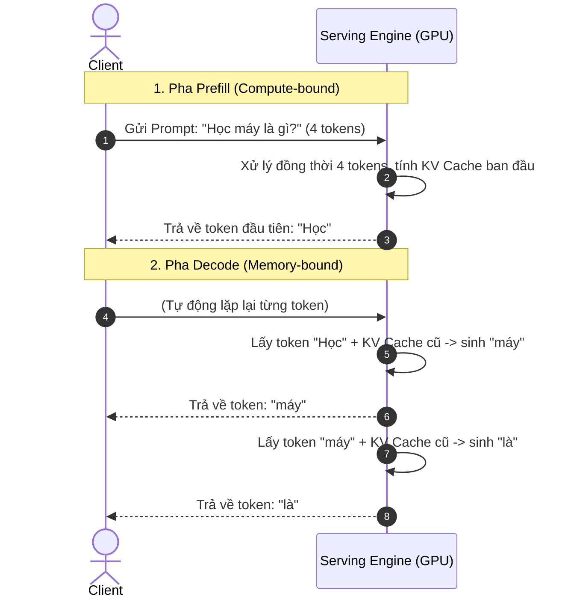

# Bài 1: Autoregressive Serving & Thách thức Quản lý Bộ nhớ (Memory Bottleneck)

Trong bài học đầu tiên này, chúng ta sẽ phân tích từ góc độ hệ thống suy luận (Inference System) để hiểu rõ bản chất toán học và vật lý đằng sau những khó khăn khi chạy mô hình ngôn ngữ lớn (LLM). Tại sao việc suy luận LLM lại chậm? Tại sao bộ nhớ GPU luôn bị cạn kiệt mặc dù card đồ họa của bạn có hiệu năng tính toán khổng lồ?

---

## 1. Quy trình Suy luận Autoregressive: Prefill vs Decode

Quá trình suy luận của một mô hình Transformer Decoder (như Llama, GPT) là **tự hồi quy (autoregressive)** — tức là để sinh ra token tiếp theo, mô hình cần tất cả các token đã sinh ra trước đó làm đầu vào. Quá trình này được chia làm hai pha hoàn toàn khác biệt về mặt tính toán:



### Pha 1: Prefill Phase (Giai đoạn xử lý Prompt)
* **Nhiệm vụ**: Nhận toàn bộ chuỗi Prompt đầu vào (ví dụ: 1024 tokens), tính toán song song các biểu diễn ẩn (hidden states) và khởi tạo các khóa trị ban đầu (Key và Value - KV Cache) cho tất cả các tầng Attention.
* **Đặc điểm tính toán**: Do toàn bộ Prompt được đưa vào mô hình cùng một lúc, các phép nhân ma trận (Matrix Multiplication - GEMM) được thực hiện song song với kích thước Batch lớn hiệu dụng ($N \times d$). Điều này giúp tận dụng tối đa các nhân tính toán Tensor Core trên GPU.
* **Bottleneck**: **Compute-bound** (Nghẽn do năng lực tính toán). Tốc độ của pha này phụ thuộc trực tiếp vào số TFLOPS (Tera Floating-point Operations Per Second) của GPU.

### Pha 2: Decode Phase (Giai đoạn sinh Token)
* **Nhiệm vụ**: Sinh từng token một cách tuần tự (step-by-step). Ở mỗi bước, mô hình chỉ nhận duy nhất **1 token** vừa sinh ra ở bước trước làm đầu vào mới, kết hợp với KV Cache đã lưu của các bước cũ để tính toán Attention, sinh ra token tiếp theo.
* **Đặc điểm tính toán**: Vì đầu vào ở mỗi bước chỉ là 1 token (Batch size hiệu dụng bằng 1), các phép nhân ma trận biến thành phép nhân ma trận với vector (GEMV). Phép toán này có hiệu năng tính toán cực thấp.
* **Bottleneck**: **Memory-bound** (Nghẽn do băng thông bộ nhớ). Tốc độ của pha này phụ thuộc trực tiếp vào tốc độ đọc/ghi dữ liệu của bộ nhớ GPU (HBM - High Bandwidth Memory).

---

## 2. Arithmetic Intensity: Tại sao sinh Token lại chậm?

Để giải thích tại sao pha Decode lại bị nghẽn bộ nhớ, chúng ta sử dụng khái niệm **Arithmetic Intensity** (Cường độ tính toán), định nghĩa là tỷ số giữa số lượng phép tính số học (Operations - FLOPs) trên mỗi byte dữ liệu được đọc/ghi từ bộ nhớ chính (Memory Access - Bytes).

$$\text{Arithmetic Intensity} = \frac{\text{FLOPs}}{\text{DRAM Access (Bytes)}}$$

Một thiết bị phần cứng như GPU NVIDIA H100 có:
* Năng lực tính toán (Tensor Core FP16): $\approx 1000 \text{ TFLOPS}$ (1 triệu tỷ phép tính/giây).
* Băng thông bộ nhớ (HBM3 Bandwidth): $\approx 3.35 \text{ TB/s}$ (3.35 nghìn tỷ bytes/giây).

Để tận dụng tối đa 100% công suất của GPU H100, một chương trình cần có cường độ tính toán tối thiểu:

$$\text{Intensity Min} = \frac{1000 \times 10^{12}}{3.35 \times 10^{12}} \approx 300 \text{ FLOPs/Byte}$$

### Phân tích pha Decode với Batch Size = 1:
Giả sử chúng ta chạy mô hình 70 Tỷ tham số (70B) ở định dạng FP16 (2 Bytes/tham số). Để sinh ra **1 token**:
1. **Đọc mô hình**: Chúng ta phải nạp toàn bộ 70 tỷ tham số từ HBM vào SRAM của GPU. Lượng dữ liệu đọc: $70 \times 10^9 \times 2 \text{ Bytes} = 140 \text{ GB}$.
2. **Tính toán**: Mỗi tham số tham gia vào khoảng 2 phép tính (nhân và cộng - MAC) cho mỗi token. Số phép tính: $2 \times 70 \times 10^9 = 140 \text{ GFLOPs}$.
3. **Cường độ tính toán thực tế**: 

$$\text{Intensity Decode} = \frac{140 \text{ GFLOPs}}{140 \text{ GB}} = 1 \text{ FLOP/Byte}$$

> [!WARNING]
> **Nhận xét**: Cường độ tính toán thực tế chỉ là $1 \text{ FLOP/Byte}$, nhỏ hơn gấp **300 lần** mức tối thiểu của GPU H100 ($300 \text{ FLOPs/Byte}$). 
> Điều này có nghĩa là GPU của bạn dành **99.7% thời gian để đợi** nạp trọng số từ bộ nhớ vào chip tính toán và chỉ hoạt động hết công suất trong 0.3% thời gian! Đây chính là định nghĩa kinh điển của **Memory-bound**.

---

## 3. KV Cache là gì và Cách Tính Toán Dung Lượng

Để tránh việc phải tính toán lại từ đầu các giá trị Key (Khóa) và Value (Trị) của các token trước đó ở mỗi bước Decode, chúng ta lưu chúng lại vào bộ nhớ, gọi là **KV Cache**.

```
Bước 1: Prompt "Học máy là" 
-> Tính K, V cho "Học", "máy", "là" -> Lưu vào KV Cache.

Bước 2: Sinh từ "gì"
-> Thay vì tính lại Attention cho cả "Học máy là gì", mô hình chỉ tính K, V cho từ "gì", 
   rồi ghép (concatenate) với KV Cache ("Học", "máy", "là") để tính Attention.
```

Tuy nhiên, KV Cache tăng trưởng cực kỳ nhanh theo số lượng Request (Batch size) và độ dài sinh chuỗi (Sequence length).

### Công thức tính dung lượng KV Cache cho Multi-Head Attention (MHA):

Đối với mỗi token của một Request, chúng ta cần lưu trữ các vector Key và Value trên tất cả các tầng của mô hình Transformer.

$$\text{KV Cache Size per Token (Bytes)} = 2 \times n_{\text{layers}} \times n_{\text{heads}} \times d_{\text{head}} \times b_{\text{bytes}}$$

Trong đó:
* $2$: Số lượng tensor (Key và Value).
* $n_{\text{layers}}$: Số lượng tầng Transformer (tần số lượng Block).
* $n_{\text{heads}}$: Số lượng đầu Attention của phần Key/Value.
* $d_{\text{head}}$: Kích thước của mỗi đầu Attention (thường là $\text{hidden\_size} / n_{\text{heads}}$).
* $b_{\text{bytes}}$: Số byte trên mỗi phần tử (FP16/BF16 = 2 Bytes, FP8 = 1 Byte).

### Trường hợp Grouped-Query Attention (GQA):
Trong các mô hình hiện đại (như Llama 3, Mistral), số lượng đầu Key/Value ($n_{\text{heads\_kv}}$) nhỏ hơn số lượng đầu Query ($n_{\text{heads\_q}}$) theo một hệ số nén (thường là 8). Công thức trên sẽ sử dụng $n_{\text{heads\_kv}}$ thay vì $n_{\text{heads\_q}}$.

### Ví dụ thực tế: Tính toán KV Cache cho Llama-3-8B-Instruct (FP16)
Thông số kỹ thuật mô hình:
* $n_{\text{layers}} = 32$
* $n_{\text{heads\_q}} = 32$
* $n_{\text{heads\_kv}} = 8$ (sử dụng GQA)
* $\text{hidden\_size} = 4096 \Rightarrow d_{\text{head}} = 4096 / 32 = 128$
* $b_{\text{bytes}} = 2$ (BF16)

Áp dụng công thức:

$$\text{KV Cache per Token} = 2 \times 32 \times 8 \times 128 \times 2 = 131,072 \text{ Bytes} \approx 128 \text{ KB/token}$$

Nếu chúng ta Serving mô hình này và phục vụ đồng thời:
* **Batch Size** = $128$ requests
* **Context Length** (Prompt + Output) = $4096$ tokens/request
* **Tổng dung lượng KV Cache yêu cầu**:

$$\text{Total KV Cache} = 128 \text{ requests} \times 4096 \text{ tokens} \times 128 \text{ KB} = 67,108,864 \text{ KB} \approx 64 \text{ GB VRAM}$$

> [!IMPORTANT]
> **Kết luận**: Chỉ riêng KV Cache đã chiếm tới **64 GB VRAM**. Bản thân trọng số mô hình Llama-3-8B chiếm khoảng **16 GB VRAM** ($8 \times 10^9 \times 2 \text{ Bytes}$). 
> Như vậy, KV Cache chiếm phần lớn không gian bộ nhớ GPU và là yếu tố cốt lõi quyết định khả năng scale-up hệ thống serving.

---

## 4. Vấn đề Phân mảnh Bộ nhớ (Memory Fragmentation)

Trước khi vLLM ra đời, các hệ thống serving truyền thống (như Hugging Face Transformers) phân bổ bộ nhớ KV Cache một cách **tĩnh và liên tục** cho mỗi request dựa trên chiều dài chuỗi tối đa (`max_model_len` hoặc `max_seq_len`, ví dụ 2048 hoặc 4096 tokens). 

Điều này dẫn đến 3 vấn đề phân mảnh nghiêm trọng:

```
Vùng nhớ GPU cấp phát tĩnh cho 1 Request (Max 2048 Tokens):
[ ████████████████░░░░░░░░░░░░░░░░░░░░░░░░░░░░░░░░░░░░░░░░░░░ ]
  |<-- Prompt & -->||<------------ Bộ nhớ lãng phí ------------>|
    Tokens đã sinh      Dành sẵn cho tương lai nhưng chưa dùng tới
```

1. **Lãng phí do Cấp phát dư thừa (Over-allocation - Reservation)**: Hệ thống phải đặt trước bộ nhớ tương ứng với `max_seq_len` mặc dù request có thể kết thúc rất sớm (ví dụ chỉ sinh ra 50 tokens). Lượng bộ nhớ còn lại bị khóa và không thể chia sẻ cho các request khác.
2. **Phân mảnh nội bộ (Internal Fragmentation)**: Xảy ra khi dữ liệu thực tế nhỏ hơn kích thước phân bổ tĩnh của trang nhớ.
3. **Phân mảnh ngoại bộ (External Fragmentation)**: Do vòng đời các request khác nhau, việc liên tục cấp phát và giải phóng các phân vùng bộ nhớ có kích thước khác nhau làm cho VRAM bị băm nhỏ thành các mảnh li ti. Mặc dù tổng dung lượng trống lớn, nhưng không có vùng nhớ liên tục nào đủ lớn để chứa một request mới, dẫn đến lỗi Out-Of-Memory (OOM).

Theo thống kê của nghiên cứu PagedAttention, các hệ thống serving cũ lãng phí từ **60% đến 80% bộ nhớ GPU** cho các vùng trống vô dụng này.

---

## 💡 Tổng kết bài học
* Suy luận LLM chia làm 2 pha: **Prefill** (Compute-bound) và **Decode** (Memory-bound).
* Pha Decode bị giới hạn bởi tốc độ nạp dữ liệu từ HBM của GPU, dẫn đến hiệu suất tính toán thực tế cực thấp (~1 FLOP/Byte).
* Cách duy nhất để tăng băng thông hệ thống (throughput) là tăng **Batch Size** để tận dụng tối đa sức mạnh của GPU.
* Tuy nhiên, việc tăng Batch Size bị giới hạn bởi kích thước khổng lồ của **KV Cache** và sự kém hiệu quả của cơ chế cấp phát tĩnh gây phân mảnh bộ nhớ.

Ở bài tiếp theo, chúng ta sẽ xem cách vLLM giải quyết triệt để bài toán phân mảnh bộ nhớ này bằng thuật toán đột phá: **PagedAttention**.
