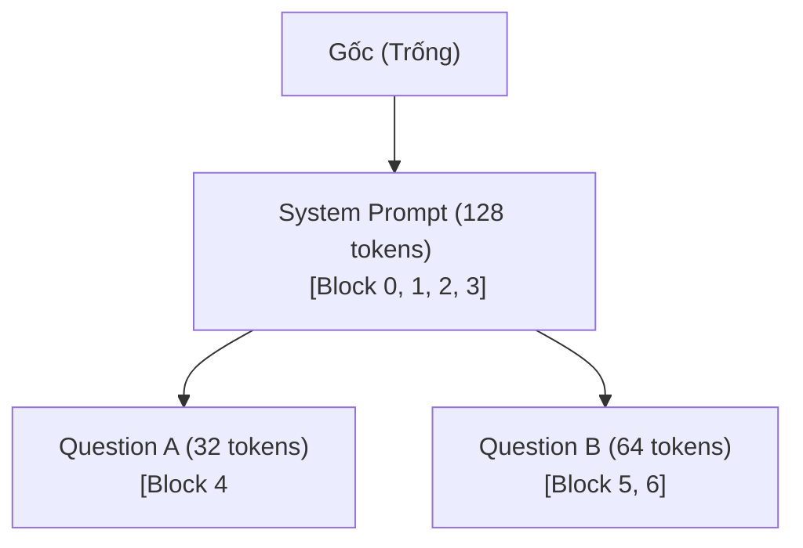

# Bài 2.2: RadixAttention & Cơ chế Tự động Chia sẻ Cache (Automatic Prefix Caching)

Trong các bài toán phục vụ LLM thực tế, một lượng lớn các yêu cầu gửi đến hệ thống thường chia sẻ chung một phần nội dung (Prefix). Ví dụ điển hình là các Prompt hệ thống (System Prompts - quy định luật chơi, ngữ cảnh của bot), ngữ cảnh tài liệu trong các ứng dụng RAG (Retrieval-Augmented Generation), hoặc lịch sử hội thoại của cùng một người dùng trong phòng chat đa lượt (Multi-turn Chat).

Nếu mỗi lần người dùng gửi tin nhắn mới, GPU lại phải chạy lại từ đầu pha Prefill cho toàn bộ phần Prompt cũ, hệ thống sẽ bị lãng phí một lượng tài nguyên tính toán khổng lồ. Để giải quyết triệt để vấn đề này, vLLM giới thiệu cơ chế **Automatic Prefix Caching (APC)** vận hành bởi giải thuật **RadixAttention**.

Bài học này sẽ đi sâu phân tích cấu trúc dữ liệu và logic quản lý bộ nhớ của cơ chế này.

---

## 1. Cội nguồn ý tưởng: Chia sẻ KV Cache ở mức độ Trang (Block-level Sharing)

Nhờ cấu trúc bộ nhớ phân trang của **PagedAttention** (Bài 2), bộ nhớ KV Cache được chia nhỏ thành các block vật lý độc lập (mỗi block chứa 16 hoặc 32 tokens). Điều này mở ra cơ hội chia sẻ bộ nhớ: **Nếu hai request có phần đầu prompt hoàn toàn giống nhau, chúng có thể cùng trỏ vào các block KV Cache vật lý giống nhau trên GPU.**

```
Request 1 (System Prompt + Question A):
[Block 0 (System)] ➔ [Block 1 (System)] ➔ [Block 2 (QA)]

Request 2 (System Prompt + Question B):
[Block 0 (System)] ➔ [Block 1 (System)] ➔ [Block 3 (QB)]
                          ^
                          | (Hai request cùng trỏ chung vào Block 0 và 1)
```

Tuy nhiên, thách thức lớn là: **Làm thế nào để hệ thống tự động nhận diện phần trùng lặp giữa các request bất kỳ mà không tốn chi phí đối sánh chuỗi chậm chạp?** 

Câu trả lời của vLLM là **RadixAttention** — quản lý KV Cache dưới dạng một cây tiền tố **Radix Tree** trực tiếp trên bộ nhớ.

---

## 2. Giải thuật RadixAttention: Quản lý Cache dưới dạng Cây Tiền Tố

Thay vì quản lý KV Cache dưới dạng một mảng danh sách phẳng, vLLM biểu diễn toàn bộ các block KV Cache đã được tính toán trong hệ thống thành một cấu trúc cây gọi là **Radix Tree**.

### 2.1. Cấu trúc dữ liệu Radix Tree
* **Nút (Nodes)**: Mỗi nút đại diện cho một chuỗi các tokens (được băm - hash để tra cứu nhanh).
* **Cạnh (Edges)**: Liên kết cha-con thể hiện mối quan hệ nối tiếp của văn bản.
* **Liên kết bộ nhớ**: Mỗi nút trên cây sẽ lưu giữ danh sách các **con trỏ trỏ đến các Block vật lý** tương ứng trên GPU VRAM chứa KV Cache của chuỗi token đó.



### 2.2. Quy trình Tra cứu và Khớp Tiền Tố (Cache Lookup & Matching)
Khi một request mới đi vào bộ lập lịch:
1.  **Băm & So khớp (Radix Search)**: Bộ quản lý sẽ duyệt từ nút Gốc (Root) của cây Radix, tìm kiếm đường đi có các chuỗi token khớp với Prompt của request mới.
2.  **Khớp tối đa (Max Prefix Match)**: Giả sử Prompt dài 200 tokens và tìm thấy đường đi trên cây khớp được 128 tokens đầu tiên (Nút `System Prompt`).
3.  **Tái sử dụng (Cache Hit)**: 
    * vLLM sẽ lấy danh sách các Block vật lý của Nút `System Prompt` gán trực tiếp vào bảng trang (Block Table) của request mới.
    * GPU **hoàn toàn không cần chạy pha Prefill cho 128 tokens này**. 
    * GPU chỉ cần chạy Prefill cho $200 - 128 = 72$ tokens còn lại (pha tính toán giảm đi đáng kể, giúp tăng tốc độ phản hồi - TTFT vượt trội).
4.  **Tách nút (Radix Insert & Split)**: Phần tokens mới (72 tokens) sau khi GPU prefill xong sẽ được tạo thành một nút con mới nối vào nút `System Prompt` trên cây.

---

## 3. Thu hồi và Giải phóng Bộ nhớ: Thuật toán LRU (Least Recently Used)

VRAM GPU là hữu hạn. Khi số lượng request tăng lên, cây Radix sẽ phình to ra và chiếm dụng toàn bộ các Block vật lý của GPU. Lúc này, vLLM cần một cơ chế dọn dẹp cache thông minh để giải phóng không gian cho các request mới.

vLLM sử dụng cơ chế **LRU Eviction (Thu hồi theo thời gian sử dụng gần nhất)**:

### 3.1. Các trạng thái của Nút trên Cây:
* **Pinned (Đang bị khóa)**: Nút chứa KV Cache của các request đang trong trạng thái chạy (`RUNNING`). Các block này **không được phép giải phóng** dưới bất kỳ hình thức nào.
* **Cached (Đang lưu trữ)**: Nút chứa KV Cache của các request đã hoàn thành (`FINISHED`). Các block này tạm thời chưa được dùng, nhưng được giữ lại trên cây để phòng trường hợp có request mới trùng khớp.

### 3.2. Cơ chế Eviction (Trục xuất):
Khi GPU cạn kiệt block trống cho request mới:
1.  Hệ thống sẽ duyệt các nút ở trạng thái **Cached** và tìm các nút có **thời gian truy cập cuối cùng (Last Accessed Time) lâu nhất**.
2.  Hệ thống sẽ giải phóng các block vật lý của nút này trả lại cho VRAM Block Pool, và xóa nút tương ứng khỏi cây Radix.
3.  Quá trình này lặp lại cho đến khi có đủ block trống phục vụ cho pha Prefill tiếp theo.

---

## 4. Khảo sát Mã nguồn thực tế trong vLLM

Trong phiên bản **vLLM V1**, logic điều phối và quản lý Prefix Caching nằm tại:
*   [vllm/v1/core/kv_cache_manager.py](file:///Users/admin/TuanDung/repos/vllm/vllm/v1/core/kv_cache_manager.py): Lớp `KVCacheManager` điều khiển việc cấp phát và khớp tiền tố.
*   Cây Radix thực tế được tích hợp trong hệ thống cấp phát trang. Khi cấu hình `enable_prefix_caching=True` được kích hoạt, trình quản lý khối sẽ thay thế bộ cấp phát tiêu chuẩn bằng một bộ cấp phát có nhận biết tiền tố (Prefix-aware Allocator).

Lớp `KVCacheManager` tra cứu cây Radix để lấy danh sách các block đã tính toán:
```python
# Mô phỏng logic khớp block trong KVCacheManager
def allocate_request(self, request_id: str, token_ids: List[int]):
    # 1. Khớp tiền tố dài nhất trên cây Radix
    matched_blocks, matched_tokens_len = self.radix_tree.match_prefix(token_ids)
    
    # 2. Gán các block đã khớp cho request (Cache Hit)
    self.block_table[request_id] = list(matched_blocks)
    
    # 3. Tính toán số lượng block còn thiếu cho phần còn lại
    remaining_tokens = token_ids[matched_tokens_len:]
    # ... chỉ chạy prefill cho remaining_tokens
```

---

## 💡 Tổng kết bài học

* **Automatic Prefix Caching (APC)** là cơ chế tận dụng tính chất lưu trữ phân khối của PagedAttention để tái sử dụng các block KV Cache giữa các yêu cầu khác nhau.
* **RadixAttention** sử dụng cấu trúc cây tiền tố **Radix Tree** để thực hiện việc đối sánh và băm chuỗi nhanh chóng trực tiếp trên GPU.
* Cơ chế **LRU Eviction** đảm bảo hệ thống tự động tái cấu trúc và giải phóng các cache lâu ngày không dùng để GPU không bao giờ rơi vào trạng thái tràn bộ nhớ (OOM).
* Việc tối ưu hóa này giúp giảm chi phí Prefill, hạ thấp đáng kể chỉ số độ trễ Time-to-First-Token (TTFT) trong các ứng dụng chatbot và tác vụ RAG ngữ cảnh lớn.
