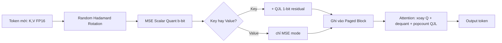

# Bài 5: Tích hợp TurboQuant vào vLLM KV Cache

Đây là bài "kỹ thuật hệ thống" trọng tâm: ta lấy thuật toán TurboQuant (Bài 2–4) và **ánh xạ nó vào kiến trúc thực tế của vLLM** để nén KV Cache lúc serving. Mục tiêu là chỉ rõ **chính xác** TurboQuant phải "cắm" vào đâu trong đường đi của dữ liệu, những kernel nào cần viết, và so sánh với cơ chế **FP8 KV Cache** mà vLLM đã có sẵn.

> [!NOTE]
> TurboQuant chưa được merge sẵn trong vLLM upstream (tính tới thời điểm biên soạn). Bài này phân tích **một thiết kế tích hợp** dựa trên kiến trúc vLLM v1 thực tế — coi như một bản "RFC kỹ thuật". Nó cũng là bản đồ để bạn tự prototype.

---

## 1. KV Cache sống ở đâu trong vLLM?

Nhắc lại kiến trúc vLLM v1 (xem chuỗi *vLLM Internals*):

| Khái niệm | File mã nguồn vLLM (v1) | Vai trò |
| :--- | :--- | :--- |
| Quản lý block KV Cache (paging) | `vllm/v1/core/kv_cache_manager.py` | Cấp phát logical→physical blocks |
| Ghi K/V vào cache | kernel `reshape_and_cache` (CUDA) | Sau khi tính K,V cho token mới, ghi vào đúng slot block |
| Đọc & tính Attention | `vllm/v1/attention/backends/*` (FlashAttention/FlashInfer) | Đọc K,V từ paged cache, tính $\text{softmax}(QK^\top)V$ |
| Cấu hình dtype của cache | tham số `kv_cache_dtype` (vd `"auto"`, `"fp8"`) | Quyết định định dạng lưu trữ KV |

Vòng đời một vector K/V ở pha **decode**:

```text
hidden ─► W_k,W_v ─► (K_new, V_new)  ──►  [reshape_and_cache] ──► Paged KV Cache (HBM)
                                                                        │
   Q_new ───────────────────────────────────────────────────► [Attention kernel] ──► output
                                                                  (đọc lại toàn bộ K,V)
```

TurboQuant phải chen vào **đúng hai điểm**: lúc **ghi** (mã hóa K/V) và lúc **đọc** (giải mã trong attention).

---

## 2. Điểm cắm 1 — Mã hóa khi ghi vào cache (Write Path)

Thay vì ghi K/V dạng FP16, ta chèn đường ống TurboQuant ngay trước `reshape_and_cache`. **Phép xoay được thực hiện trên chiều head** ($d = d_{\text{head}}$, ví dụ $128$ — rất tiện vì là lũy thừa của 2, hợp với Hadamard):

```python
# Pseudo-code: write path cho MỖI head, mỗi token mới (pha decode)
def turbo_encode_kv(k_new, v_new):           # k_new, v_new: [d_head] FP16
    # --- Key: dùng inner-product mode (có QJL) vì K tham gia <q,k> ---
    k_rot   = fwht_sign(k_new, seed)         # random Hadamard rotation O(d log d)
    k_norm  = norm(k_rot)                    # lượng hóa norm riêng (vài bit)
    k_q     = mse_quant(k_rot / k_norm)      # b bit/kênh (Lloyd-Max bảng cứng)
    k_resid = (k_rot / k_norm) - dequant(k_q)
    k_qjl   = sign(S @ k_resid)              # 1-bit QJL khử bias (Bài 4)
    store_key(k_q, k_norm, k_qjl)

    # --- Value: MSE mode (không cần unbiased) ---
    v_rot   = fwht_sign(v_new, seed)
    v_norm  = norm(v_rot)
    v_q     = mse_quant(v_rot / v_norm)
    store_value(v_q, v_norm)
```

> [!IMPORTANT]
> **Tính data-oblivious là chìa khóa cho serving**: bảng Lloyd-Max và ma trận xoay đều **cố định, không phụ thuộc dữ liệu** (chỉ cần seed). Vì vậy mã hóa mỗi token là $O(d\log d)$, **không có bước calibration/profiling online** — đúng thứ vòng lặp decode cần. Đây chính là lý do TurboQuant phù hợp serving hơn các VQ học codebook.

---

## 3. Điểm cắm 2 — Giải mã trong Attention (Read Path)

Đây là phần khó nhất về kỹ thuật. Khi tính attention, kernel phải "hiểu" KV đã nén. Mấu chốt là tính chất **bảo toàn tích vô hướng** của phép xoay (Bài 2):

$$\langle q, k\rangle = \langle Rq, Rk\rangle = \langle \tilde q, \tilde k\rangle.$$

Nghĩa là **ta cũng phải xoay query $q$ bằng cùng $R$** rồi mới so với $\tilde k$ đã lưu:

```python
# Pseudo-code: read path trong attention kernel
def turbo_attention(q_new, keys_q, values_q):
    q_rot = fwht_sign(q_new, seed)                 # xoay query bằng CÙNG R
    scores = []
    for k_q, k_norm, k_qjl in keys_q:              # duyệt các token trong block
        # ước lượng <q,k> unbiased = phần MSE + phần QJL (Bài 4)
        s = k_norm * dot(q_rot, dequant(k_q)) \
          + qjl_estimate(q_rot, k_qjl)
        scores.append(s)
    attn = softmax(scores)
    out = sum(a * v_norm * dequant(v_q)            # Value: MSE mode
              for a, (v_q, v_norm) in zip(attn, values_q))
    return out
```

Hai lựa chọn hiện thực:

* **(A) Dequantize-on-the-fly**: giải nén $\tilde k \to$ FP16 ngay trên SRAM rồi dùng Tensor Core như thường. Đơn giản, tái dùng FlashAttention, nhưng không tận dụng được tính toán bit-thấp. Giống cách **AWQ** hoạt động (xem *vLLM Internals, Bài 7.1*).
* **(B) Fused low-bit kernel**: tính $\langle \tilde q, \tilde k\rangle$ trực tiếp ở dạng nén + cộng phần QJL bằng phép **popcount/XOR** (vì QJL là 1-bit sign). Nhanh hơn nhưng cần viết custom CUDA/Triton kernel tích hợp vào attention backend.

> [!WARNING]
> **Thách thức lớn nhất** của tích hợp TurboQuant (so với FP8 đơn thuần) là phải **nhúng phép xoay Hadamard và phần QJL vào trong attention kernel**. FlashAttention hiện không hỗ trợ sẵn; đây là phần cần đầu tư kỹ thuật kernel nhiều nhất. Đổi lại, ta được chất lượng ở **2.5–3.5 bit** thay vì 8 bit như FP8.

---

## 4. So sánh với FP8 KV Cache có sẵn của vLLM

vLLM đã hỗ trợ `kv_cache_dtype="fp8"` (E4M3/E5M2). Vậy TurboQuant hơn gì?

| Tiêu chí | FP8 KV Cache (vLLM hiện có) | TurboQuant KV Cache |
| :--- | :--- | :--- |
| **Bit/kênh** | 8 bit | **2.5 – 3.5 bit** (nén thêm ~2–3×) |
| **Xử lý outlier** | Kém — outlier "ăn" hết dải động của FP8 | **Tốt** — random rotation trải đều outlier |
| **Tối ưu inner product** | Không (chỉ là làm tròn dtype) | **Có** — QJL cho ước lượng unbiased |
| **Calibration** | Cần scale (per-tensor/per-token) | **Data-oblivious**, chỉ cần seed |
| **Độ phức tạp kernel** | Thấp (phần cứng hỗ trợ FP8 sẵn) | **Cao** (cần Hadamard + QJL trong kernel) |
| **Khoảng cách tới tối ưu** | Xa | **Hằng số ~2.72 lần cận Shannon** |

> [!TIP]
> Cách nhìn đúng: FP8 là "đổi dtype rẻ tiền, phần cứng lo"; TurboQuant là "**thuật toán nén gần tối ưu**, đổi độ phức tạp kernel lấy tỷ lệ nén cao gấp đôi/ba ở cùng chất lượng". Với hệ thống serving context cực dài (nơi KV Cache thống trị VRAM), việc giảm từ 8 bit xuống 3 bit nghĩa là **gấp ~2.6× batch/context** trên cùng GPU.

---

## 5. Tương tác với PagedAttention & Prefix Caching

Một vài lưu ý hệ thống khi nén KV theo block:

* **Layout block**: mỗi block giờ chứa mã nén (b-bit codes + norm + qjl bits) thay vì FP16. `kv_cache_manager.py` chỉ cần biết **kích thước byte mới mỗi slot** — logic paging (cấp phát/CoW/eviction) **không đổi**, vì TurboQuant chỉ thay đổi *nội dung* slot chứ không phải *cách quản lý* slot.
* **Prefix caching**: vì TurboQuant **data-oblivious** (cùng seed → cùng mã cho cùng vector), hai prefix giống nhau vẫn cho cùng KV nén → **vẫn share block được**. Đây là một điểm cộng so với VQ data-dependent (mã có thể đổi theo lô calibration).
* **Per-token, không per-tensor**: TurboQuant lượng hóa **mỗi vector K/V độc lập** (rotation trên chiều head). Không cần thống kê toàn cục → hợp hoàn hảo với continuous batching, nơi token đến không đồng bộ.



---

## 6. Lộ trình prototype thực tế (gợi ý)

1. **Bản dễ trước (mode A)**: hiện thực TurboQuant **MSE mode** cho cả K và V, dùng **dequantize-on-the-fly** + FlashAttention sẵn có. Đo perplexity ở 3.5/3/2.5 bit so với FP16/FP8.
2. **Thêm QJL cho Key**: bổ sung pha QJL để khử bias attention, kiểm tra cải thiện ở bit thấp (≤ 2.5).
3. **Fused kernel (mode B)**: viết Triton kernel hợp nhất rotation + low-bit dot + popcount để lấy tốc độ.
4. **Benchmark hệ thống**: đo throughput & max context length tăng được trên cùng GPU khi thay FP16/FP8 KV bằng TurboQuant.

> [!NOTE]
> Bài 8 (`toy_quant/`) hiện thực bước 1–2 ở mức NumPy để bạn **kiểm chứng chất lượng** (MSE & sai số inner product) trước khi đầu tư viết CUDA kernel. Đó là quy trình kỹ thuật đúng: *chứng minh thuật toán đúng ở Python, rồi mới tối ưu kernel.*

---

## 7. Tổng kết Bài 5

* TurboQuant cắm vào vLLM tại **hai điểm**: mã hóa khi **ghi** (trước `reshape_and_cache`) và giải mã khi **đọc** (trong attention backend).
* Phép xoay thực hiện **trên chiều head** ($d_{\text{head}}$); vì bảo toàn inner product, **query cũng phải được xoay** bằng cùng $R$.
* **Key** dùng inner-product mode (QJL), **Value** dùng MSE mode.
* So với **FP8 KV Cache** có sẵn: TurboQuant nén sâu hơn (2.5–3.5 bit), xử lý outlier tốt hơn, unbiased — đổi lại **độ phức tạp kernel cao hơn**.
* Logic **PagedAttention/prefix caching không đổi**; TurboQuant data-oblivious nên **vẫn share block** được.

👉 Bài tiếp theo: **[Bài 6 — Cận dưới lý thuyết & Tính tối ưu](./lesson_6_lower_bound_optimality.md)**, chứng minh vì sao hằng số gap đúng bằng ~2.72.
