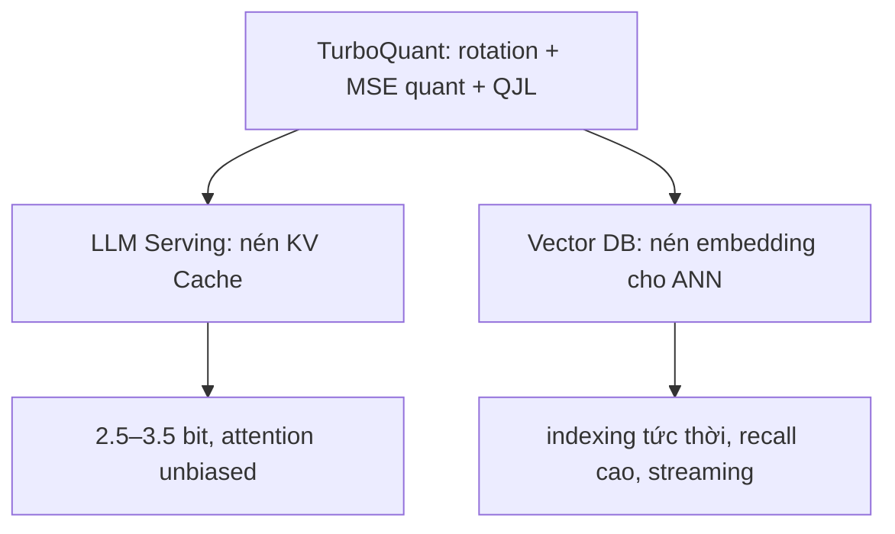

# Bài 7: Ứng dụng — Nearest Neighbor Search & Vector Database

KV Cache không phải ứng dụng duy nhất. Vì TurboQuant tối ưu **cả inner product distortion**, nó là một ứng viên xuất sắc cho **tìm kiếm lân cận gần nhất (Nearest Neighbor Search - NNS)** và **vector database** — nền tảng của RAG, semantic search, hệ thống gợi ý. Bài này phân tích vì sao TurboQuant **vượt Product Quantization (PQ)** ở đúng những điểm PQ yếu nhất.

---

## 1. Bài toán ANN & vai trò của quantization

Vector database lưu hàng triệu–tỷ embedding $\{x_1, \dots, x_N\} \subset \mathbb R^d$. Cho query $q$, ta cần tìm nhanh các $x_i$ có **tích vô hướng lớn nhất** (Maximum Inner Product Search) hoặc **khoảng cách nhỏ nhất**:

$$\text{Top-}k = \arg\max_i \langle q, x_i\rangle.$$

Lưu toàn bộ ở FP32 quá tốn RAM và băng thông. Giải pháp kinh điển: **nén embedding bằng quantization** rồi tính tích vô hướng xấp xỉ trên bản nén. Phương pháp thống trị suốt thập kỷ qua là **Product Quantization (PQ)**.

---

## 2. Product Quantization và điểm yếu của nó

PQ chia vector $d$ chiều thành $M$ đoạn con, chạy **K-means** trên mỗi đoạn để học một codebook, rồi thay mỗi đoạn bằng chỉ số centroid gần nhất.

| Điểm yếu của PQ | Hệ quả |
| :--- | :--- |
| **Phải training (K-means)** trên dữ liệu | Indexing **rất chậm** — hàng phút tới hàng giờ cho dataset lớn |
| **Data-dependent** | Khi dữ liệu mới khác phân phối (distribution shift) → recall tụt; phải **train lại codebook** |
| **Không cập nhật online tốt** | Thêm/xóa vector liên tục (streaming) là cơn ác mộng |
| **Bias inner product** | Centroid co cụm gây thiên lệch ước lượng $\langle q,x\rangle$ |

Đây chính xác là những điểm TurboQuant giải quyết bằng thiết kế **data-oblivious + unbiased**.

---

## 3. Vì sao TurboQuant thắng ở NNS

### 3.1. Indexing gần như tức thời

Vì TurboQuant **không cần training** (không K-means, chỉ random rotation + bảng quantizer cố định), việc "index" một vector chỉ là chạy đường ống mã hóa $O(d\log d)$. Paper báo cáo con số ấn tượng:

> **Indexing dataset trong ~0.0013 giây so với ~239 giây của Product Quantization** — nhanh hơn ~**5 bậc độ lớn** (~180,000×).

```text
   Thời gian indexing (thang log)
   PQ   : ████████████████████████████  ~239 s   (chạy K-means)
   TQ   : ▏                              ~0.0013 s (chỉ rotate + quantize)
```

> [!IMPORTANT]
> Với hệ thống **streaming** (embedding đổ vào liên tục — log, mạng xã hội, cảm biến), khả năng "index tức thời, không train lại" là **thay đổi cuộc chơi**: không còn các đợt rebuild index tốn kém, không lo distribution shift.

### 3.2. Recall cao hơn nhờ ước lượng unbiased

Vì TurboQuant cho **ước lượng inner product không thiên lệch** (QJL, Bài 4), thứ hạng Top-$k$ ít bị sai lệch hệ thống hơn PQ → **recall cao hơn** ở cùng số bit. Paper khẳng định TurboQuant *"outperforms existing product quantization techniques in recall while reducing indexing time to virtually zero."*

### 3.3. Bền vững trước Distribution Shift

Codebook của PQ học từ phân phối tại thời điểm train; query/dữ liệu lệch phân phối → recall sụt. TurboQuant **data-oblivious**: quy tắc mã hóa giống nhau cho mọi vector, nên **không có khái niệm "lệch phân phối khỏi tập train"** — chất lượng ổn định.

---

## 4. Bảng so sánh tổng hợp: TurboQuant vs PQ

| Tiêu chí | Product Quantization (PQ) | TurboQuant |
| :--- | :--- | :--- |
| **Indexing** | Chậm (K-means, ~239s) | **Tức thời (~0.0013s)** |
| **Phụ thuộc dữ liệu** | Data-dependent (cần train) | **Data-oblivious** |
| **Streaming / online** | Khó (rebuild index) | **Tự nhiên** |
| **Distribution shift** | Recall tụt | **Bền vững** |
| **Ước lượng inner product** | Có bias | **Unbiased (QJL)** |
| **Recall @ cùng bit** | Cơ sở | **Cao hơn** |
| **Đảm bảo lý thuyết** | Heuristic | **Near-optimal ~2.72× cận dưới** |

---

## 5. Sợi chỉ đỏ: cùng một thuật toán, hai thế giới

Điểm đẹp nhất là **cùng một TurboQuant** phục vụ cả hai miền tưởng như xa nhau:



Cả hai đều quy về **một bài toán toán học**: nén vector chiều cao mà bảo toàn tích vô hướng. Đó là lý do một kết quả lý thuyết "thuần túy" (Bài 6) lại có sức ảnh hưởng kỹ thuật rộng đến vậy — từ GPU serving tới hạ tầng search.

---

## 6. Tổng kết Bài 7

* NNS/Vector DB cần nén embedding mà **bảo toàn tích vô hướng** — đúng thế mạnh của TurboQuant.
* **PQ** mạnh nhưng **chậm indexing, data-dependent, có bias** và yếu trước distribution shift.
* TurboQuant cho **indexing tức thời (~0.0013s vs 239s)**, **recall cao hơn** (nhờ unbiased), **bền streaming & distribution shift**.
* Cùng một thuật toán phục vụ **cả KV Cache lẫn Vector DB** — sức mạnh của một nền tảng lý thuyết tổng quát.

👉 Bài cuối: **[Bài 8 — Thực hành: Tự xây dựng Toy TurboQuant](./lesson_8_toy_turboquant.md)**, hiện thực và kiểm chứng mọi thứ bằng NumPy.
